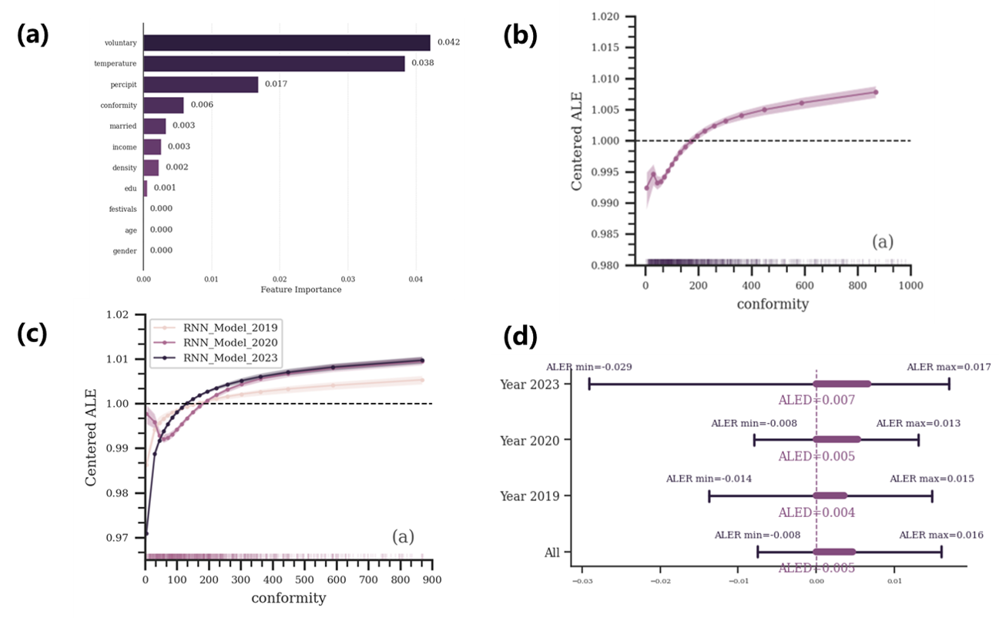

# Conformity in human mobility: COVID-19 enhancing the conformity effect
### Authors: Ioana Bica, Ahmed M. Alaa, Mihaela van der Schaar
 
#### International Conference on Machine Learning (ICML) 2020

Thanks for [the work of Ioana Bica, Ahmed M. Alaa, Mihaela van der Schaar](https://arxiv.org/abs/1902.00450)

## Abstract

Understanding the nuances of conformity in human mobility is essential for predicting collective behavior and informing strategies for behavioral changes. Our study leverages a large-scale longitudinal mobility dataset and introduces the CausalMobility framework to reveal the dynamics of conformity causal effects in human mobility before, during and after the COVID-19 pandemic. We found people conform to others’ mobility behaviors. We observed a transient weakening of conformity in the short term of COVID-19’s outbreak, with anti-conformity behaviors emerging, followed by a strengthening of conformity in the long-term recovery and post-COVID phase. This shift was significantly influenced by the assimilation of previously anti-conformist individuals, an increase in highly conformist populations, and a notable intensification of conformity among older adults, wealthier individuals, and those with higher educational attainment. These findings provide critical insights for developing targeted interventions aimed at behavioral change.

### Some results

**SCI predicts daily mobility, the conformist social influence enhanced during the post-pandemic period**. (a) The SCI variable exerts an influence on the prediction of individual mobility, whose feature importance in the prediction model ranking after the weather- and pandemic-related variables but above socioeconomic indicators. (b) An elevated SCI variable on the prior will cause an increased forecast of an individual's mobility on the following day. Daily mobility exhibits a positive conformity effect. (c) During the three-year study period of pre-, during, and post-pandemic, variations in the conformity effect were observed. In terms of the range of Average Latent Effect (ALE), the year 2023 showed the greatest fluctuation in ALE values for the SCI, whereas the year 2020 exhibited the smallest variation in ALE values. (d) Based on the ALE deviation (ALED) metric, the average impact of the Social Contact Index (SCI) on predictive outcomes has progressively increased from 2019 to 2023, indicating a year-on-year intensification of the conformity effect. (e) The disappearance of reverse conformists and the growth in the proportion of strong conformists contributed to this increase in the average conformity effect observed in the post-pandemic period.

### Reference

```
@article{bica2020tsd,
  title={Time Series Deconfounder: Estimating Treatment Effects over Time in the Presence of Hidden Confounders},
  author={Bica, Ioana and Alaa, Ahmed M and van der Schaar, Mihaela},
  journal={International Conference on Machine Learning},
  year={2020}
}
```
